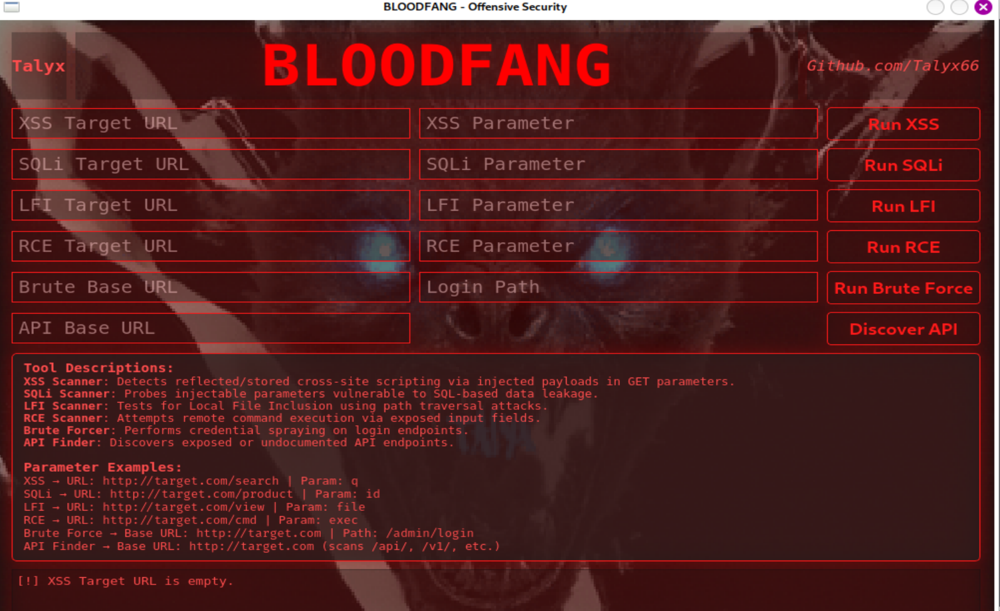

# BLOODFANG

# Description
BLOODFANG is my second advanced red team offensive toolkit designed for rapid reconnaissance, password spraying, brute forcing, API endpoint discovery, and more. Perfect for penetration testers who demand precision and speed

# Features
- Password Spraying
- Brute Force Attacks
- API Endpoint Discovery
- Modular and expandable
- Simple CLI interface

# Installation
git clone https://github.com/Talyx66/BLOODFANG.git
cd BLOODFANG
pip install -r requirements.txt

# Usage
python3 bloodfang.py   (or)   python3 Bloodfang_gui.py
Follow on-screen prompts to select tools and targets

# Contribution
Contributions welcome! Open issues or submit pull requests

# Disclaimer
Use responsibly with explicit permission. Unauthorized use is illegal.
